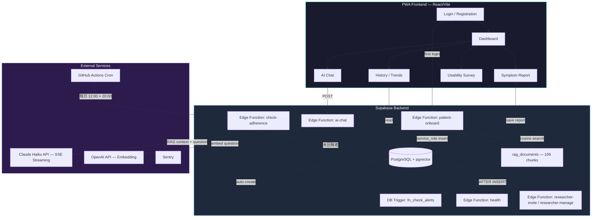

# 痔瘡術後 AI 衛教追蹤系統

痔瘡手術（hemorrhoidectomy / stapled hemorrhoidopexy）術後症狀追蹤與 AI 衛教 PWA。
臨床研究用途，符合 IRB 要求。

## 架構



---

## 角色與權限

系統內部三層角色，全部透過 Supabase JWT 的 **`app_metadata`**（server-controlled，使用者不可竄改）做隔離：

| Role | 可以做的事 | 範圍限制 |
|------|---------|---------|
| `patient` | 自我回報、查看自己的趨勢、與 AI 對話 | RLS 限制只能讀寫自己的 `study_id` |
| `researcher` | 查看所屬主刀醫師（`surgeon_id`）的所有病人資料、審核 AI 對話、產生病人邀請碼 | RLS 限制只能看自己 `surgeon_id` 的資料 |
| `pi` | 全研究 read/write、邀請/停用 researcher、稽核全部 | 無範圍限制 |

> ⚠️ **不要把 role 寫在 `user_metadata`**——這個欄位使用者可以自己改，等於把權限交給 client。所有 RLS / Edge Function 一律從 `app_metadata.role` 讀。

---

## 收案流程（研究者 SOP）

### 一次性：Bootstrap 第一個 PI 帳號

第一個 PI 必須手動建（之後的 researcher / PI 都透過 dashboard 邀請即可）。
在 Supabase SQL Editor 執行：

```sql
-- 1. 建立 auth user（用 Auth API 路徑，避免 NULL token bug）
SELECT auth.uid();  -- 確認連線

-- 改用 Supabase Dashboard → Authentication → Users → "Add user"（with password）
-- 建立 user 後記下 user.id，然後執行下一步 ↓

-- 2. 把 role 提升為 pi（必須在 app_metadata，不可在 user_metadata）
UPDATE auth.users
SET raw_app_meta_data = raw_app_meta_data || jsonb_build_object(
      'role', 'pi',
      'surgeon_id', 'HSF',                  -- 你自己的 surgeon code
      'study_id', 'RESEARCHER-001'
    )
WHERE email = 'your-pi@example.com';
```

> 💡 **如果你選擇直接用 SQL `INSERT auth.users` 而不走 Dashboard 路徑**，務必把 `confirmation_token` / `recovery_token` / `email_change_token_new` / `email_change_token_current` / `email_change` / `phone_change` / `phone_change_token` / `reauthentication_token` 全部設成空字串 `''`（不可 NULL），否則 Supabase Auth 的 Go scanner 會在登入時 panic 拋 500。

### 後續：邀請其他 researcher / PI

PI 登入 dashboard → 「研究團隊管理」區塊 → 填 email + 姓名 + 角色（researcher 需指定主刀 `surgeon_id`）→ 系統會：
1. 透過 `researcher-invite` edge function 寄 magic-link 邀請信
2. 將 role + surgeon_id 寫入 `app_metadata`（伺服器端，使用者不可竄改）
3. 寫入 `audit_trail`

被邀請者點 email 連結即可設密碼啟用。

### 收一個病人

```
步驟 1 ─ Researcher 在 Dashboard 產生邀請碼
┌────────────────────────────────────────────────────┐
│  研究者儀表板 → 「產生病人邀請碼」                    │
│  ├── 主刀前綴：HSF（自動帶入你的 surgeon_id）         │
│  ├── 病人編號：003（你指定）                          │
│  ├── 過期天數：30                                    │
│  └── [產生邀請碼]                                    │
│      → 系統產生隨機 6 字母 token，例如 DIEGCW         │
└────────────────────────────────────────────────────┘

步驟 2 ─ 把這組 token 給病人
  口頭/簡訊：「打開 App → 點註冊 → 邀請碼是 DIEGCW」
  （可印在出院單上、或產 QR code 給病人掃）

步驟 3 ─ 病人在手機上自行註冊
  打開 App 網址 → 點「註冊」→ 填入：
  ├── 邀請碼：DIEGCW
  ├── 手術日期
  ├── Email + 密碼
  └── 完成！patient-onboard edge function 自動：
       • 建 patients row（study_id = HSF-003，從 token 反查）
       • 寫 app_metadata.role = 'patient'
       • 寫 app_metadata.study_id = HSF-003
       • 將 study_invites.status 標記為 'used'

步驟 4 ─（選做）建立 PII 對照表
  在 Supabase SQL Editor 執行：
  INSERT INTO pii_patients (study_id, mrn_enc, name_enc)
  VALUES ('HSF-003',
          pgp_sym_encrypt('院內病歷號', vault.read_secret('pii_key')),
          pgp_sym_encrypt('病人姓名',   vault.read_secret('pii_key')));
  -- ⚠️ 不要把加密金鑰直接寫在 SQL 裡，請存在 Supabase Vault 或 env。

步驟 5 ─ 日常監控
  Researcher Dashboard：
  ├── 📊 所有病人回報狀態與趨勢（依 surgeon_id 自動過濾）
  ├── 🔔 警示列表（DB trigger 自動產生）
  ├── 💬 AI 對話審核
  └── 🕐 系統每天 12:00 / 20:00 自動 push 提醒未回報的病人
```

> **每個 study_id 只能產生一次邀請碼。**已使用過的 study_id 若想重發，需先在 study_invites 表手動清除，或用新編號。

### 病人端的日常使用

```
每天打開 App →
  📋 Dashboard 顯示 POD（術後天數）+ 今日回報狀態
  → 填寫症狀回報（疼痛 NRS / 出血 / 排便 / 發燒 / 傷口）
  → 有問題可問 AI 衛教助手（Claude API）
  → DB trigger 自動判斷是否需要發警示
  → 📊 History 查看趨勢圖
```

### 什麼是 PWA？病人怎麼安裝？

PWA（Progressive Web App）是一個網頁，但可以像 native app 一樣使用。不需要上 App Store。

| 平台 | 安裝方式 |
|------|---------|
| **Android** | Chrome 打開網址 → 自動提示「新增到主畫面」 |
| **iPhone** | Safari 打開網址 → 點分享 🔗 → 「加入主畫面」 |

加入後，App 會像一般 app 一樣出現在手機桌面上（全螢幕、有 icon）。

---

## 資料流

1. **病人註冊** → Supabase Auth → `patient-onboard` Edge Function 驗 invite token → `patients` 表 + 寫 `app_metadata.role / study_id`
2. **每日回報** → `symptom_reports` INSERT → DB trigger `fn_check_alerts()` → `alerts` 表
3. **AI 衛教** → `ai-chat` Edge Function（內部驗 JWT + rate limit）→ OpenAI embedding → pgvector RAG 檢索 → Claude Haiku API（SSE streaming，含 top-3 衛教 context）
4. **未回報提醒** → GitHub Actions cron → `check-adherence` Edge Function → `pending_notifications`
5. **研究團隊管理** → PI 從 Dashboard → `researcher-invite` / `researcher-manage` Edge Function → magic-link 邀請信
6. **健康檢查** → `health` Edge Function → GitHub Actions uptime monitor

## 安全設計

| 層面 | 實作 |
|------|------|
| PII 分離 | `pii_patients`（加密）↔ `patients`（去識別化） |
| Row Level Security | 全表啟用，三層角色隔離 patient / researcher / pi；researcher 額外受 `surgeon_id` scope 限制 |
| Auth | Edge Function 內部 `auth.getUser(jwt)` 驗證 + `app_metadata.role` 角色檢查（注意：Supabase Gateway 層 `verify_jwt` 設為 false，驗證實作在 function body 中） |
| API Key | 僅存在 Edge Function env，前端不暴露 |
| CORS | Edge Function 層 allowlist：Vercel domain + localhost（可由 `ALLOWED_ORIGINS` env 覆寫） |
| 註冊防護 | 每病人個別 6 字母 invite token（隨機產生，30 天過期，single-use） |
| Alert Engine | Server-side DB trigger（不可被前端繞過） |
| AI Fallback | RAG 未命中時回覆固定安全模板，不使用模型通用知識 |
| 可觀測性 | Sentry 即時告警 + Supabase error logs + AI metrics |
| 稽核 | `audit_trail` 表 + auto-triggers（report / alert / admin actions） |

## 目錄結構

```
Hemorrhoids_PostOp/
├── prototype/               # 主要 app 原始碼
│   ├── src/                 # React 前端
│   ├── supabase/            # Edge Functions + Migrations
│   │   ├── functions/
│   │   │   ├── ai-chat/             # AI 衛教（RAG + Claude API + JWT）
│   │   │   ├── patient-onboard/     # 病人自動建檔（驗 invite token）
│   │   │   ├── check-adherence/     # 每日未回報檢查
│   │   │   ├── researcher-invite/   # PI 邀請 researcher / 另一個 PI
│   │   │   ├── researcher-manage/   # PI list / ban / unban researcher
│   │   │   ├── admin-reset-password/# Admin 重設密碼
│   │   │   ├── send-test-push/      # Push 通知測試
│   │   │   └── health/              # 健康檢查 endpoint
│   │   └── migrations/      # DB schema 變更（含 pgvector）
│   ├── rag/                 # 衛教知識庫（RAG 來源）
│   │   ├── 衛教_*.md        # 8 篇衛教文件（71 chunks）
│   │   └── *.pdf            # 3 篇臨床指引（35 chunks）
│   ├── scripts/
│   │   ├── ingest-rag.mjs   # RAG ingestion（chunk + embed + store）
│   │   ├── sync-prompt.mjs  # System prompt 同步
│   │   └── generate-vapid-keys.mjs
│   ├── shared/              # System prompt (source of truth)
│   ├── e2e/                 # Playwright E2E tests（9 spec files）
│   ├── db/                  # Schema reference
│   └── docs/                # KNOWN_LIMITATIONS.md
├── .github/workflows/
│   ├── ci.yml               # CI — Lint, Build & Test
│   ├── cron-notify.yml      # 每日 adherence check
│   ├── backup.yml           # DB backup
│   └── uptime.yml           # Health check monitor
└── README.md                # ← 你在這裡
```

## 快速開始（開發者）

```bash
cd prototype
cp .env.example .env        # 填入 Supabase credentials
npm install
npm run dev                 # http://localhost:5173
npm test                    # 318 unit tests
npm run test:e2e            # 67 E2E tests across 9 spec files
```

## 環境變數

| 變數 | 說明 | 設定位置 |
|------|------|---------|
| `VITE_SUPABASE_URL` | Supabase project URL | `.env` / Vercel |
| `VITE_SUPABASE_ANON_KEY` | Supabase anon key | `.env` / Vercel |
| `VITE_SENTRY_DSN` | Sentry error tracking DSN | `.env` / Vercel |
| `VITE_VAPID_PUBLIC_KEY` | Web Push VAPID 公鑰 | `.env` / Vercel |
| `CLAUDE_API_KEY` | Claude API key（Haiku, SSE streaming） | Supabase secrets |
| `OPENAI_API_KEY` | OpenAI API key（RAG embedding） | Supabase secrets + `.env` |
| `CRON_SECRET` | Adherence cron 驗證密碼 | Supabase + GitHub Secrets |
| `ALLOWED_ORIGINS` | Edge Function CORS allowlist（逗號分隔） | Supabase secrets |
| `SUPABASE_SERVICE_ROLE_KEY` | Service role（ingestion 與 admin 用） | `.env`（不進 git） |

> 邀請碼是**每病人個別產生**的隨機 6 字母 token（透過 `study_invites` 表管理），不是全域環境變數。

## 已知限制

詳見 [docs/KNOWN_LIMITATIONS.md](prototype/docs/KNOWN_LIMITATIONS.md)

## License

Private — 臨床研究用途
