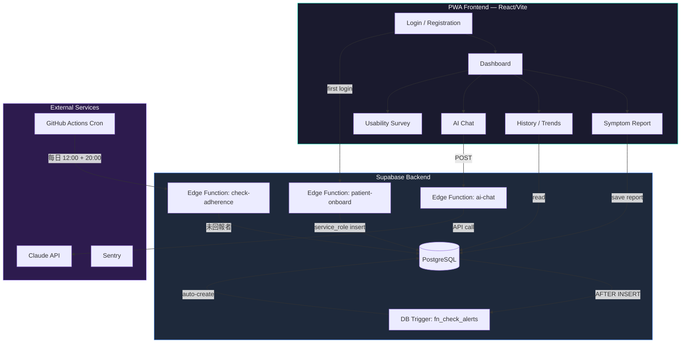

# 痔瘡術後 AI 衛教追蹤系統

痔瘡手術（hemorrhoidectomy / stapled hemorrhoidopexy）術後症狀追蹤與 AI 衛教 PWA。
臨床研究用途，符合 IRB 要求。

## 架構



---

## 收案流程（研究者 SOP）

### 事前準備（做一次就好）

1. **建立研究者帳號**
   - Supabase Dashboard → Authentication → Users → Add user
   - `user_metadata` 設定為 `{ "role": "researcher", "study_id": "RESEARCHER-001" }`

2. **決定收案編號規則** — 例如 `HEM-001`、`HEM-002`、`HEM-003`…

3. **確認邀請碼** — 預設為 `HEMORRHOID2026`（可在 Vercel env 修改 `VITE_INVITE_CODE`）

### 每收一個病人

```
步驟 1 ─ 門診/病房告知病人
┌─────────────────────────────────────────────────────┐
│  「掃描 QR code 或打開網址，                          │
│   用邀請碼 HEMORRHOID2026 註冊，                     │
│   你的研究編號是 HEM-003」                            │
└─────────────────────────────────────────────────────┘

步驟 2 ─ 病人自行在手機上註冊
  打開 App 網址 → 點「註冊」→ 填入：
  ├── 邀請碼：HEMORRHOID2026
  ├── 研究編號：HEM-003（你指定的）
  ├── 手術日期：選擇日期
  ├── Email + 密碼
  └── 完成！系統自動建立 patient 紀錄

步驟 3 ─（選做）建立 PII 對照表
  在 Supabase SQL Editor 執行：
  INSERT INTO pii_patients (study_id, mrn_enc)
  VALUES ('HEM-003', pgp_sym_encrypt('院內病歷號', '你的加密金鑰'));

步驟 4 ─ 日常監控
  用 researcher 帳號登入 App → Researcher Dashboard
  ├── 📊 查看所有病人回報狀態與趨勢
  ├── 🔔 查看警示列表（DB trigger 自動產生）
  ├── 💬 審核 AI 對話紀錄
  └── 🕐 系統每天 12:00 / 20:00 自動提醒未回報的病人
```

### 病人端的日常使用

```
每天打開 App →
  📋 Dashboard 顯示 POD（術後天數）+ 今日回報狀態
  → 填寫症狀回報（疼痛 NRS / 出血 / 排便 / 發燒 / 傷口）
  → 有問題可問 AI 衛教助手（Claude API）
  → DB trigger 自動判斷是否需要發警示
  → 📊 History 查看趨勢圖
```

### 什麼是 PWA？病人怎麼安裝？

PWA（Progressive Web App）是一個網頁，但可以像 native app 一樣使用。不需要上 App Store。

| 平台 | 安裝方式 |
|------|---------|
| **Android** | Chrome 打開網址 → 自動提示「新增到主畫面」 |
| **iPhone** | Safari 打開網址 → 點分享 🔗 → 「加入主畫面」 |

加入後，App 會像一般 app 一樣出現在手機桌面上（全螢幕、有 icon）。

---

## 資料流

1. **病人註冊** → Supabase Auth → `patient-onboard` Edge Function → `patients` 表
2. **每日回報** → `symptom_reports` INSERT → DB trigger `fn_check_alerts()` → `alerts` 表
3. **AI 衛教** → `ai-chat` Edge Function（JWT 驗證 + rate limit）→ Claude API
4. **未回報提醒** → GitHub Actions cron → `check-adherence` Edge Function → `pending_notifications`
5. **研究者** → Dashboard 讀取去識別化資料 + 警示列表 + AI 對話審核

## 安全設計

| 層面 | 實作 |
|------|------|
| PII 分離 | `pii_patients`（加密）↔ `patients`（去識別化） |
| Row Level Security | 全表啟用，角色隔離 patient / researcher / pi |
| Auth | JWT 單一路徑 + Supabase Gateway verify-jwt 雙層驗證 |
| API Key | 僅存在 Edge Function env，前端不暴露 |
| CORS | 只允許 Vercel domain + localhost |
| 註冊防護 | Invite code 驗證 |
| Alert Engine | Server-side DB trigger（不可被前端繞過） |
| AI Fallback | Production 禁用 mock，失敗顯示誠實錯誤 |
| 可觀測性 | Sentry 即時告警 + Supabase error logs + AI metrics |
| 稽核 | `audit_trail` 表 + auto-triggers（report/alert） |

## 目錄結構

```
痔瘡AI衛教/
├── prototype/               # 主要 app 原始碼
│   ├── src/                 # React 前端
│   ├── supabase/            # Edge Functions + Migrations
│   │   ├── functions/
│   │   │   ├── ai-chat/     # AI 衛教（Claude API + JWT 驗證）
│   │   │   ├── patient-onboard/  # 病人自動建檔
│   │   │   └── check-adherence/  # 每日未回報檢查
│   │   └── migrations/      # DB schema 變更
│   ├── scripts/             # Build tools (sync-prompt)
│   ├── shared/              # System prompt (source of truth)
│   ├── db/                  # Schema reference
│   └── docs/                # KNOWN_LIMITATIONS.md
├── .github/workflows/
│   ├── ci.yml               # CI — Lint, Build & Test
│   └── cron-notify.yml      # 每日 adherence check
└── README.md                # ← 你在這裡
```

## 快速開始（開發者）

```bash
cd prototype
cp .env.example .env        # 填入 Supabase credentials
npm install
npm run dev                 # http://localhost:5173
npm test                    # 100 unit tests
```

## 環境變數

| 變數 | 說明 | 設定位置 |
|------|------|---------|
| `VITE_SUPABASE_URL` | Supabase project URL | `.env` / Vercel |
| `VITE_SUPABASE_ANON_KEY` | Supabase anon key | `.env` / Vercel |
| `VITE_INVITE_CODE` | 註冊邀請碼（預設 `HEMORRHOID2026`）| `.env` / Vercel |
| `VITE_SENTRY_DSN` | Sentry error tracking DSN | `.env` / Vercel |
| `CLAUDE_API_KEY` | Claude API key | Supabase Edge Function env |
| `CRON_SECRET` | Adherence cron 驗證密碼 | Supabase + GitHub Secrets |

## 已知限制

詳見 [docs/KNOWN_LIMITATIONS.md](prototype/docs/KNOWN_LIMITATIONS.md)

## License

Private — 臨床研究用途
