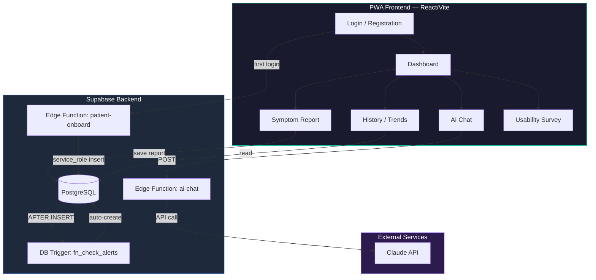

# 痔瘡術後 AI 衛教追蹤系統

痔瘡手術（hemorrhoidectomy / stapled hemorrhoidopexy）術後症狀追蹤與 AI 衛教 PWA。
臨床研究用途，符合 IRB 要求。

## 架構



## 資料流

1. **病人註冊** → Supabase Auth → `patient-onboard` Edge Function → `patients` 表
2. **每日回報** → `symptom_reports` INSERT → DB trigger `fn_check_alerts()` → `alerts` 表
3. **AI 衛教** → `ai-chat` Edge Function → Claude API → 回應（失敗時顯示「暫時不可用」，不 fallback）
4. **研究者** → Dashboard 讀取去識別化資料 + 警示列表 + AI 對話審核

## 安全設計

| 層面 | 實作 |
|------|------|
| PII 分離 | `pii_patients`（加密）↔ `patients`（去識別化） |
| Row Level Security | 全表啟用，角色隔離 patient / researcher / pi |
| API Key | 僅存在 Edge Function env，前端不暴露 |
| CORS | 只允許 Vercel domain + localhost |
| 註冊防護 | Invite code 驗證 |
| Alert Engine | Server-side DB trigger（不可被前端繞過） |
| AI Fallback | Production 禁用 mock，失敗顯示誠實錯誤 |

## 目錄結構

```
痔瘡AI衛教/
├── prototype/               # 主要 app 原始碼
│   ├── src/                 # React 前端
│   ├── supabase/            # Edge Functions + Migrations
│   ├── shared/              # System prompt (source of truth)
│   ├── db/                  # Schema reference
│   └── docs/                # KNOWN_LIMITATIONS.md
├── .github/workflows/       # CI/CD (GitHub Actions)
└── README.md                # ← 你在這裡
```

## 快速開始

```bash
cd prototype
cp .env.example .env        # 填入 Supabase credentials
npm install
npm run dev                 # http://localhost:5173
```

## 環境變數

| 變數 | 說明 |
|------|------|
| `VITE_SUPABASE_URL` | Supabase project URL |
| `VITE_SUPABASE_ANON_KEY` | Supabase anon key |
| `VITE_INVITE_CODE` | 註冊邀請碼（預設 `HEMORRHOID2026`）|

## 已知限制

詳見 [docs/KNOWN_LIMITATIONS.md](prototype/docs/KNOWN_LIMITATIONS.md)

## License

Private — 臨床研究用途
